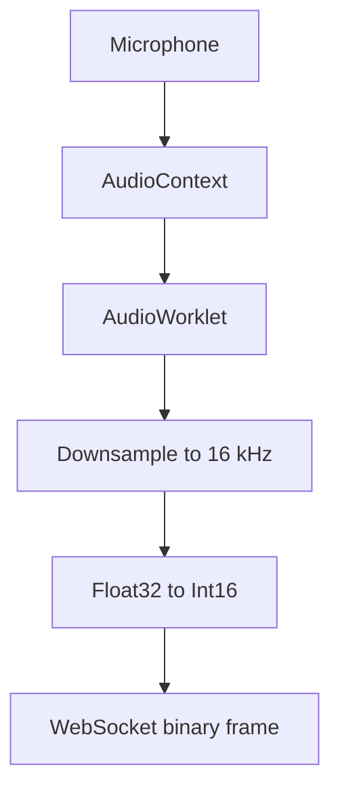
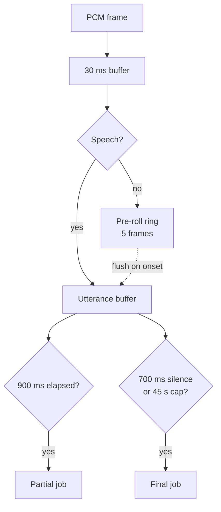
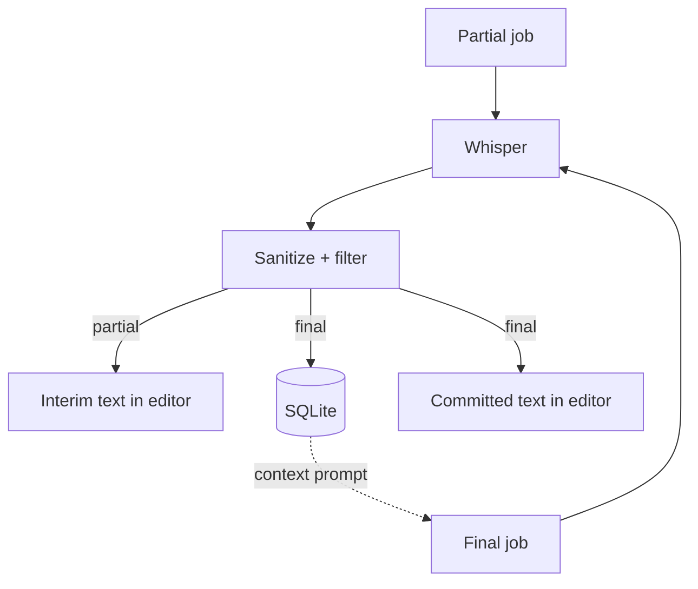
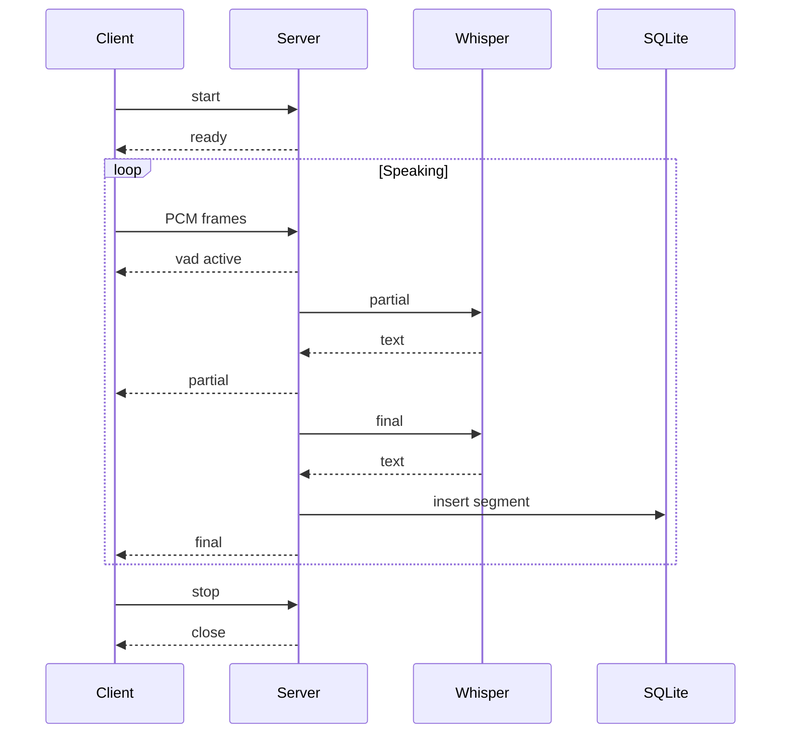

### `Overview`

- You speak, words appear in the editor as you talk, and every finalized utterance lands in a SQLite transcript you can reopen later. 

### `Install`

        python -m venv .venv
        .venv/bin/activate
        pip install -r requirements.txt

### `Run`

        python main.py

  
- Then open `http://127.0.0.1:8765.` The first run will show a loading status while the model initializes.
- If you want the server on a different port or interface, edit ***main.py.***
- Note that serving on a non loopback address over plain HTTP will trip the secure context check, so you would need TLS in front of it.

### `How the streaming pipeline works`

- The client downsamples microphone input to 16 kHz mono and sends Int16Array frames over a binary WebSocket. 

- The server accumulates them into 30 ms frames for webrtcvad (aggressiveness 2).

- If webrtcvad fails to import, an energy-based fallback with adaptive noise floor and a 3× SNR threshold is used instead.

      | Stage | Value |
      |---|---|
      | Sample rate | 16 kHz mono |
      | VAD frame | 30 ms, aggressiveness 2 |
      | Pre-roll | 150 ms |
      | Partial interval | 900 ms |
      | Final silence | 700 ms |
      | Max utterance | 45 s |
      | Min utterance | 300 ms |

### `HTTP and WebSocket surface`

      GET  /                              UI
      GET  /api/health                    { status, model_ready }
      GET  /api/sessions?limit=N          recent sessions
      POST /api/sessions                  { language } → { session_id, language }
      GET  /api/sessions/{id}             session + ordered segments
      DEL  /api/sessions/{id}             delete session and its segments
      GET  /api/sessions/{id}/export      plain-text transcript download
      WS   /ws/stream                     binary PCM in, JSON events out

- WebSocket protocol. The client sends a JSON 
{"type":"start","language":"pt|en|auto"} first. 
- The server replies {"type":"ready","session_id":"...","language":"..."}. 
- After that the client sends Int16Array frames as binary and may send {"type":"language",...} or {"type":"stop"} as text. 
- The server emits:

      {"type":"partial","utt_id":N,"revision":R,"text":"...","confidence":C}
      {"type":"final",  "utt_id":N,"text":"...","confidence":C}
      {"type":"vad",    "active":true|false}
      {"type":"warning","utt_id":N,"message":"content_filtered"}
      {"type":"error",  "message":"rate_limited"|"model_not_ready"|"internal_error"}

- Partials carry a monotonic revision so a slow one cannot overwrite a newer one on the client.

### `Notice`

- This tool is under development, is being made available "as is," and has some limitations. For example:
- SQLite storage is not encrypted. The database sits on disk in plaintext next to main.py. 
- If that matters, put the directory on an encrypted volume.
